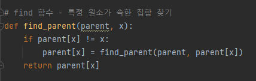
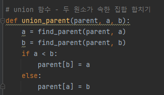
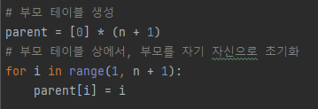
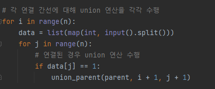
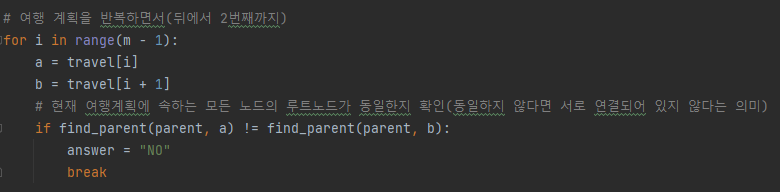

# 문제 유형
- 그래프이론
  - 서로소 집합 
    - 여행 계획이 모두 연결되어 있는 것을 확인하려면 여행 계획에 해당하는 모든 노드가 같은 집합에 속하는지를 확인해야하는 문제 

# 주요 코드 개념
- find 함수 

  

- union 함수 

  

- 각 노드의 루트 노드를 저장하기 위한 부모 테이블

  

- 각 연결 간선에 대해 union 연산 수행 

  

- 여행 계획 반복하면서 여행 계획에 속하는 모든 노드이 루트노드가 동일한지 확인

  

# 시간복잡도 