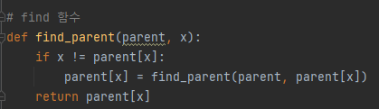
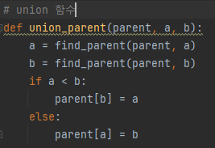
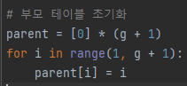
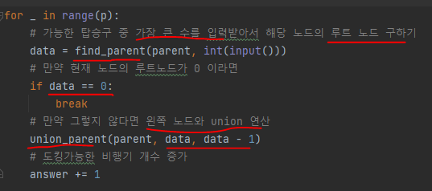

# 문제 유형 
- 그래프이론
  - 서로소 집합 알고리즘
    - 각 탑승구를 서로 다른 집합으로 나타내고 도킹하는 과정을 탑승구간 union 연산으로 생각하기 
    - 어떤 탑승구의 루트노드가 0이면 더이상 비행기가 탑승구에 착륙하지 못하는 방법으로 풀기 

# 주요 코드 개념
- find 함수 

  

- union 함수 
  
  

- 부모 테이블 

  

- 도킹

  

  - 가능한 큰 번호의 탑승구로 도킹 수행한다고 가정 
  - 도킹하는 과정은 탑승구간 union 연산
  - 새로운 비행기가 도킹되면, 해당 집합을 바로 왼쪽에 있는 집합과 합침 
  - 집합의 루트노드가 0이면, 더 이상 도킹이 불가능한 것으로 판단 

# 시간복잡도 