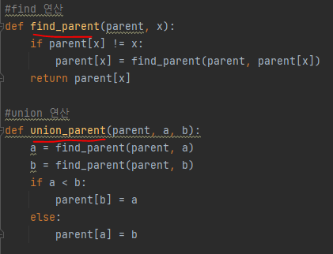
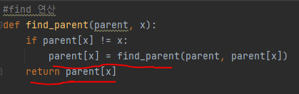

# 문제 유형
- 서로소 집합 자료구조 알고리즘 

# 주요 코드 개념
- 문제에서 
  - 팀을 합치는 연산 -> 'union 연산' 을 의미
  - 같은 팀 여부 확인 연산 -> 'find 연산' 을 의미
  
- N과 M의 범위가 모두 최대 100,000이기 때문에 
  - 경로 압축 방식의 find 함수 사용해서 시간 복잡도를 개선해야함
  ㅈ

# 시간복잡도 
