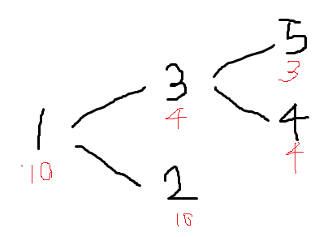
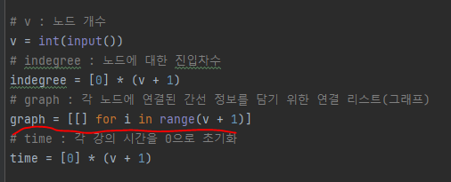
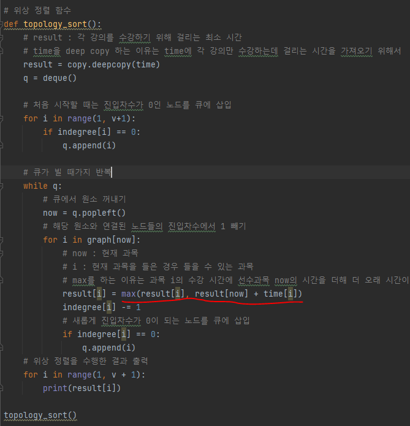

# 문제 유형
- 위상 정렬(선수 과목 문제)
# 주요 코드 개념
- 선수과목이 필요한 과목과 필요 없는 과목의 관계를 연결 리스트(이차원 리스트)로 구현
    
    
    
- 위상 정렬 함수에서 max 사용하는 이유 
  - 과목 i의 수강 시간에 선수과목 now의 시간을 더해 더 오래 시간이 걸리는 경우의 시간 값을 저장하는 방식으로 result 테이블(각 과목을 수강하기 위한 최소 시간을 저장한 테이블)을 갱신하기 위함
    
# 시간 복잡도
- 