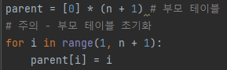

# 문제 유형 
- 그래프이론 
  - 최소 신장 트리 알고리즘  
    - 가로등이 켜진 도로만을 이용해서 모든 두 집이 서로 도달이 가능해야 한다는 조건이 있기 때문에 최소한의 비용으로 모든 집을 연결해야하므로 전형적인 최소 신장 트리 문제임
      - '임의의 두 집에 대해 가로등이 켜진 도로만으로 오갈 수 있도록' 같은 문장 있으면 최소 신장 트리 문제라는 것을 의심하기 
      
# 주요 코드 개념
- find 연산 함수

  

- union 연산 함수

  

- 부모 테이블

  

- 간선을 비용기준으로 오름차순 정렬

  

- 최소 비용의 도로부터 사이클이 발생하지 않도록 하면서 사용할 도로에 포함시키고 비용계산

  

# 주의 코드 개념 
- 부모 테이블 자기 자신으로 초기화

  

# 시간복잡도 