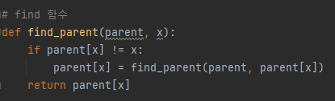
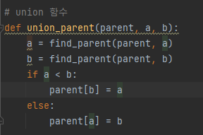
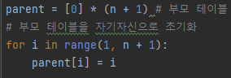
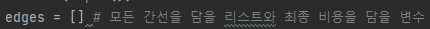
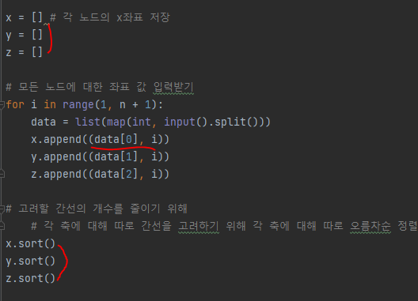
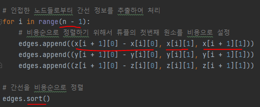
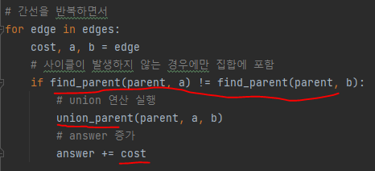

# 문제 유형 
- 그래프이론 
  - 최소신장트리(크루스칼 알고리즘) 
    - 최소한의 비용으로 N - 1개의 터널을 설치해서 모든 행성이 연결되도록 요구하기 때문에 최소신장트리를 사용해 문제 풀기 
      - 신장트리 조건
        - 모든 노드 포함 
        - 모든 노드 연결 
        - 사이클이 존재하면 안됨 
- 행성의 개수 N이 최대 100,000이기 때문에 모든 두 행성 간의 거리를 확인하는 방법으로는 문제 해결할 수 없음 
  - 터널의 비용이 min(abs(xa-xb), abs(ya-yb), abs(za-zb))이라고 정의되어있으므로 고려할 간선의 개수를 줄일 수 있음 
    - x,y,z축을 기준으로 각각 정렬 수행함
    - y축, z축은 무시하고 오직 x축만 존재한다고 가정했을 때, n - 1 의 간선만 이용해도 항상 최소 신장 트리를 만들 수 있으므로 이러한 방법을 이용하면 최소 신장 트리를 만들지 못하는 경우는 존재하지 않음
    - 따라서, 각 축에 대해 고려한 총 간선의 개수는 3 * (N - 1) 이됨
  - 결과적으로 x,y,z축에 대해 정렬 이후에 각각 n - 1개의 간선만 고려해도 최적의 솔루션을 찾을 수 있다는 아이디어를 사용해 문제 풀면됨 

# 주요 코드 개념 
- find 함수 

  

- union 함수

  

- 부모 테이블

  

- 모든 간선과 비용 담는 간선 리스트

  

- 각 노드의 x,y,z좌표 저장할 리스트 및 정렬

  

- 간선 정보를 추출한 후 비용순으로 정렬
  - append(두 노드간 거리, 노드1 인덱스, 노드2 인덱스) 

  

- 간선 반복하면서 사이클이 발생하지 않는 경우에만 집합에 포함시키고 비용 계산

    

# 시간복잡도 