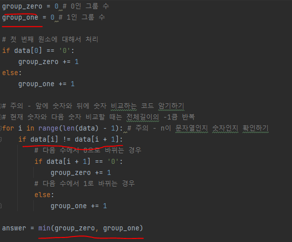
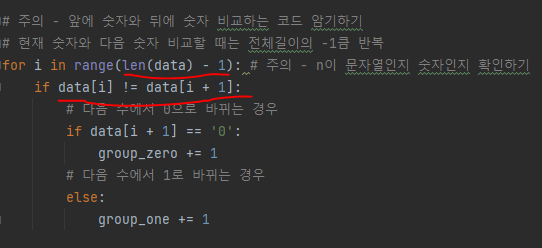

# 문제 유형
- 그리디

# 주요 코드 개념
- 최소한의 뒤집기 횟수로 문자열을 모두 같은 숫자로 만들기 위해 문자열을 이루는 각 숫자의 그룹의 수를 구해서, 그룹 수 작은 쪽을 뒤집는 것이 최소 뒤집기 횟수가 됨 

  

# 주의 코드 개념
- 입력받는 변수는 다음과 같이 사용
  - n : 행열의 크기, 데이터의 수로 사용하고
  - data : 실제 데이터

- 앞에 숫자와 뒤에 숫자 비교하는 코드 암기
  - 외부 변수 사용하지 않고 앞에 숫자와 뒤에 숫자 비교하는 방법
  
  

# 시간복잡도