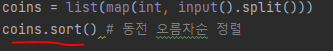
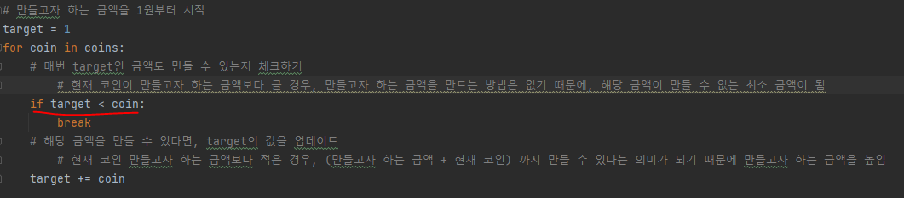

# 문제 유형
- 그리디 
  - 주어진 동전 종류로 만들 수 없는 금액의 최소값을 구하는 문제
  - 그리디 알고리즘은 현재 상태에서 매번 가장 좋아 보이는 것만을 선택하는 알고리즘
    - 이 문제에서 가장 좋은 보이는 것은 1~targte-1 까지의 모든 금액을 만들 수 있는 상태를 만드는 것이고, 
    - 따라서, 매번 taget인 금액도 만들 수 있는지(현재 확인하는 동전의 단위가 target 이하인지) 체크하는 것 

# 주요 코드 개념
- 금액이 작은 동전부터 사용해 만들 수 있는 금액을 체크할 수 있도록 동전 종류를 오름차순으로 정렬

  

- 현재 코인이 만들고자 하는 금액보다 큰 경우, 만들고자 하는 금액을 만드는 방법이 없기 때문에 해당 금액이 만들 수 없는 금액 중 최소값이 됨
  
  

# 시간복잡도