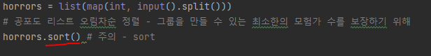

# 문제 유형
- 그리디
  - 최대로 모험가 그룹 수를 만들어야 하기 때문에 각 그룹을 형성할 시 사용할 최적해 방안을 만들어 해결하는 문제이기 때문

# 주요 코드 개념
- 공포도가 가장 낮은 모험가부터 오름차순으로 정렬되어 있다면, 항상 최소한의 모험가의 수만 포함하여 그룹 결성 가능
  - 공포도 오름차순 정렬
    

    - 현재 그룹에 포함된 모험가 수가 현재 공포도 이상이라면 최소한의 모험가만 포함시키기 위해 바로 그룹 결성
      

# 시간 복잡도 

