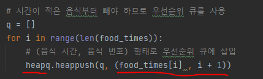
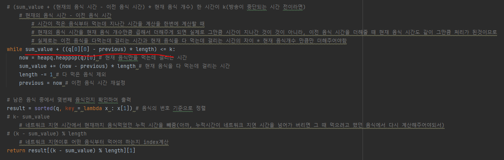
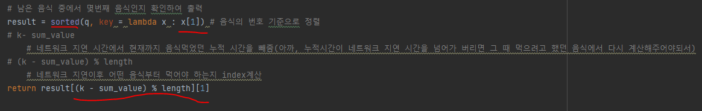

# 문제 유형 
- 그리디
  - 먹는데 시간이 적게 걸리는 음식부터 확인하는 그리디 방식으로 해결할 수 있음
    - 모든 음식을 시간을 기준으로 정렬한 뒤에, 시간이 적게 걸리는 음식부터 제거해 나가는 방식 이용
    
    

# 주요 코드 개념
- 모든 음식을 우선순위 큐(최소 힙)에 삽입
  - K초 후에 먹어햘 음식의 번호를 출력해야 하므로 우선순위 큐에 삽입할 때 (음식 시간, 음식 번호)의 튜플 형태로 삽입
    
    
  
- 방송 중단 시간 k초를 넘지않을 때까지 시간이 적은 음식부터 먹는데 지나간 시간을 계산

        

- 남은 음식 중에서 몇번째 음식인지 확인하여 출력
    
    

# 시간복잡도