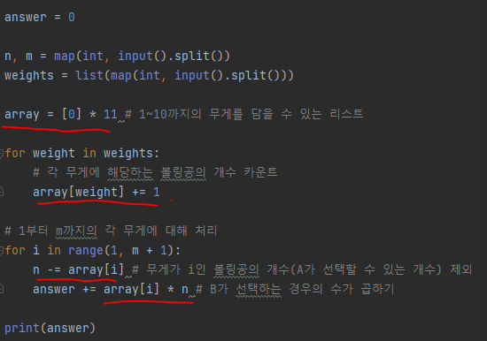

# 문제 유형
- 그리디
  - 

# 주요 코드 개념
- A가 특정한 무게의 볼링공을 선택했을 때, 이어서 B가 볼링공을 선택하는 경우 차례대로 계산 
  - A를 기준으로 무게가 낮은 볼링공부터 무게가 높은 볼링공까지 순서대로 하나씩 확인

  - A가 무게가 1인 공을 선택할 때의 경우의 수
    - 무게가 1인 공의 개수 * B가 선택하는 경우의 수 
  
  - A가 무게가 2인 공을 선택할 때의 경우의 수
      - 무게가 2인 공의 개수 * B가 선택하는 경우의 수
   
  - A가 무게가 m인 공을 선택할 때의 경우의 수
        - 무게가 m인 공의 개수 * B가 선택하는 경우의 수 
  
  - 이런식으로 경우의 수를 계산해서 더해주는 방식으로 코드 구현 
  
  

# 시간복잡도 