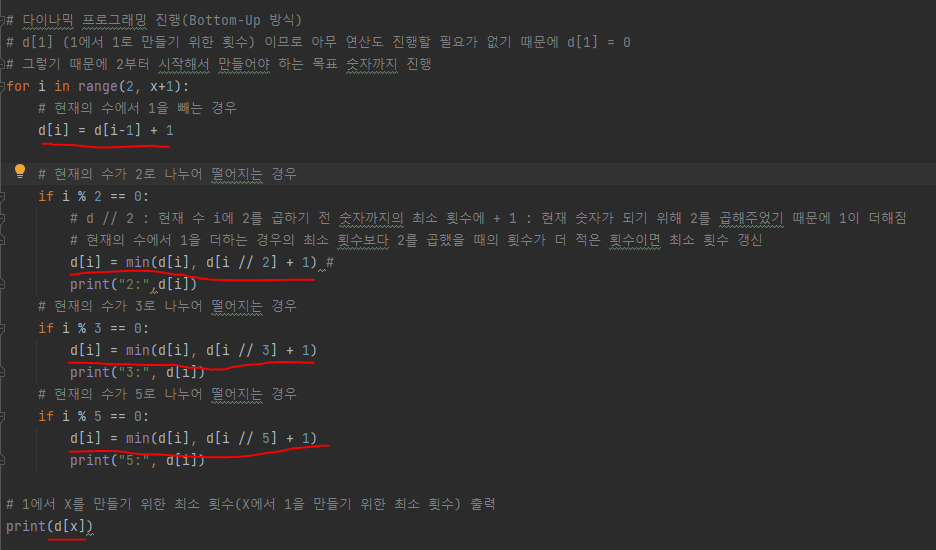

# 문제 유형
- Dynamic Programming(Bottom-Up 방식)
  - 정수 X가 주어졌을 때 X를 1로 만들기 위해 필요한 연산의 최소 횟수를 구하는 문제
  - Bottom-Up 방식으로 해결하기 위해 1에서 X를 만들기 위해 필요한 연산의 최소 횟수를 구하는 방식으로 풀기 
    - 마이너스는 플러스로, 나누기는 곱하기로

# 주요 코드 개념
- dp테이블에서 dp[1]은 1에서 1로 만들기 위해 필요한 연산 횟수이므로 아무 연산도 진행할 필요가 없기 때문에 d[i] = 0

- 점화식
  - ai = min(ai-1, ai/2, ai/3, ai/5) + 1
  - i번째 숫자를 만들기 위해 필요한 횟수 = (i-1을 만들기 위한 횟수, i/2를 만들기 위한 횟수, i/3를 만들기 위한 횟수, i/5를 만들기 위한 횟수) 중 최소 횟수 + 1
    
    
  
# 주의 코드 개념

# 시간복잡도