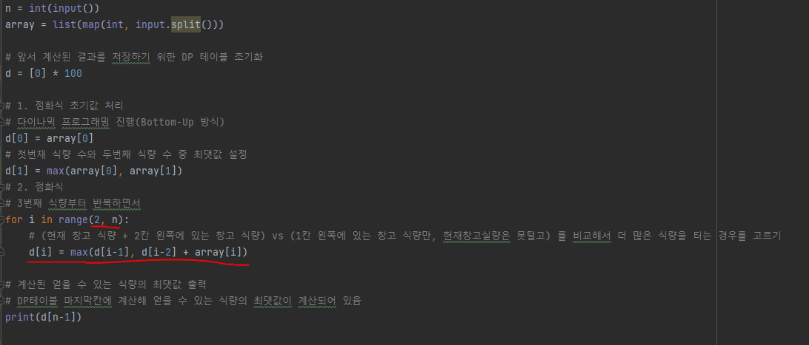

# 문제 유형 
- Dynamic Programming(Bottom-Up 방식)
  - 얻을 수 있는 식량의 최댓값을 구하는 문제
  - 현재 창고 까지 얻을 수 있는 식량의 최댓값을 구하기 위해 (바로 한칸 이전 창고까지 얻을 수 있는 식량 최댓값 or 바로 두칸 이전 창고까지 얻을 수 있는 식량 최댓값)을 이용하는 문제이기 때문에, 현재의 값을 계산하기 위해 이전의 계산된 값을 이용하는 DP 방식의 문제라고 할 수 있음

# 주요 코드 개념
- 점화식 작성할 때 다음과 같은 순서로 진행
  - 점화식 초기값 처리

    
  
  - 점화식

    

# 시간복잡도
