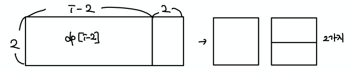

# 문제 유형
- 다이나믹 프로그래밍(Bottom-Up 방식)

# 주요 코드 개념
- 점화식 초깃값
  - dp[1] = 1
    - 가로 1까지 채울 수 있는 방법(경우의 수)가 1 x 2(세로) 덮개 1가지이기 때문
    
  - dp[2] = 3
    - 가로 2까지 채울 수 있는 방법(경우의 수)가 3가지 이기 때문 
      - 1 x 2(세로) 덮개 2개 사용
      - 2 x 1(세로) 덮개 2개 사용
      - 2 x 2(세로) 덮개 1개 사용

- 점화식
  - 덮개의 가로길이 종류는 1 또는 2이기 때문에 가로길이가 i인 바닥을 채우는 방법은 2가지가 있음   
      1. 왼쪽부터 i - 1 까지 길이가 덮개로 이미 채워져 있으면, 하나의 경우만 존재 
        - 1 x 2(세로) 덮개를 넣는 경우 
        
          
  
      2. 왼쪽부터 i - 2 까지 길이가 덮개로 이미 채워져 있으면, 2가지 경우가 존재
        - 2 x 1(세로) 덮개를 2개 넣는 경우 
        - 2 x 2(세로) 덮개를 하나를 넣은 경우
        
          
    
  - 왼쪽부터 N - 2 미만의 길이에 대해서는 고려할 필요가 없음 
    - 사용할 수 있는 덮개의 형태가 최대 2 x 2의 직사각형 형태이기 때문에 
  - 위의 개념을 점화식으로 표현하면, 
    - ai = ai-1 + ai-2 * 2
      - ai : 2 x i(세로) 크기의 바닥을 채우는 방법의 수  
      - ai-1 : i-1까지 덮개가 채워져 있으므로 그 옆에 1x2 덮개를 넣는 경우밖에 없기 때문에 경우의 수가 그대로임 
      - ai-2 
        - i-2까지 덮개가 채워져 있으므로 
          - 2 x 1(세로) 덮개를 2개 넣는 경우와
          - 2 x 2(세로) 덮개를 하나를 넣은 경우
        - 가 있으므로 ai-2까지의 경우의수에 * 2를 해주어야함
      
    
  
# 시간 복잡도 
