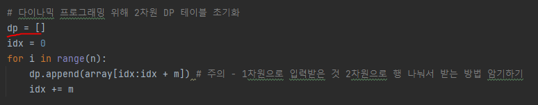
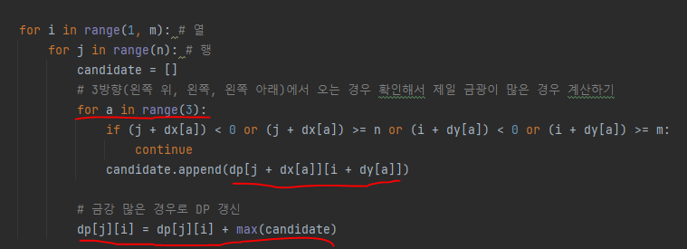
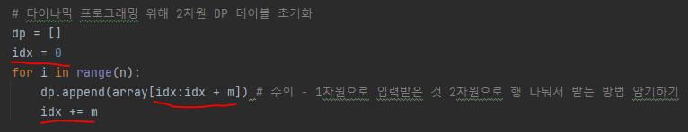
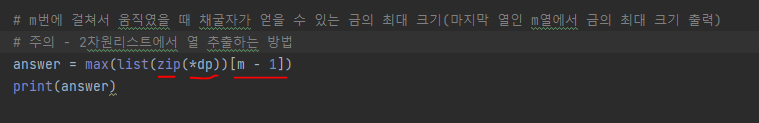

# 문제 유형
- 다이나믹 프로그래밍 
  - 각 칸마다 금을 제일 많이 캐서 온 경우의 개수를 저장하기 위해 다이나믹 프로그래밍 사용   
  - Bottom-Up 방식으로 구현
    - 반복문과 DP 테이블 사용

# 주요 코드 개념
- DP 테이블 구현 
  - 각 칸마다 금을 제일 많이 캐서 온 경우 개수를 계산해야 하는데 중뽁되어 계산하는 경우가 있기 때문에 이를 저장하기 위해 DP 테이블 사용
  
    
  
- 점화식
  - 각 칸으로 올 수 있는 경우는 오른쪽 위, 오른쪽, 오른쪽 아래에서 올 수 있는데 이는 즉, 각 칸에서 왼쪽 위, 왼쪽, 왼쪽 아래 칸 중에서 가장 금을 많이 캔 칸에서 오는 것을 고르면 됨
    - 현재 칸까지 금 개수 최대 = 현재 칸에서 캘 수 있는 금 개수 + max(왼쪽 위까지 금 개수, 왼쪽까지 금 개수, 왼쪽 아래까지 금 개수)
    
    
  
  - 점화식 초깃값
    - 맨 왼쪽 열은 원래 금 크기 대로 입력

# 주의 코드 개념
- 1차원으로 입력받은 것 2차원 리스트로 행 나눠서 받는 방법 암기
  
  

- 2차원 리스트에서 열 추출하는 방법
  
  

# 시간복잡도