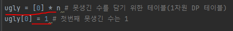
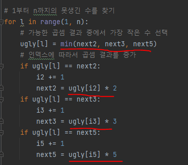

# 문제 유형
- 다이나믹 프로그래밍
  - 가능한 못생긴 수를 앞에서부터 하나씩 찾는 방법으로 해결
  - 못생긴 수에 2,3,5를 곱한 수 또한 '못생긴 수'에 해당함 
    - 이미 계산된 못생긴 수 DP 테이블에 또 2,3,5를 곱하는 식으로 하기 때문에 다이나믹 프로그래밍 

# 주요 코드 개념
- DP 테이블 
  - 못생긴 수를 담기 위한 테이블 
  
    

- 점화식
  - 가능한 곱셈 결과 중에서 가장 작은 수 선택해 인덱스 따라 곱셈 결과 증가
  
    

# 시간복잡도 
