# 문제 유형
- 그리디 알고리즘
  - 현재 문제는 전투력이 높은 병사가 앞쪽에 오는 내림차순 배치가 되도록 빼야되는 병사의 가장 작은 값을 구하는 문제이기 때문에
    - '가장 긴 감소하는 부분 수열'의 길이를 계산하는 문제로 간주하고 풀어야함 
    - 이때, '가장 긴 감소하는 부분 수열'을 계산할 때 dp 테이블을 이용 
  
# 주요 코드 개념 
- '가장 긴 감소하는 부분 수열'의 길이를 계산하는 문제이지만 '가장 긴 증가하는 부분 수열'의 길이를 계산할 때 사용하는 점화식을 그대로 사용하기 위해 기존 숫자 리스트를 뒤집어줌

  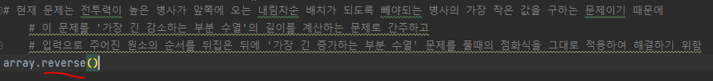

- DP 테이블

  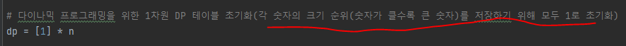

- 점화식 
  - 0 <= j < i에 대해 
    - 만약 array[j] < array[i]
      - D[i] = max(D[i], D[j] + 1)
        - array[i] : 타겟 숫자
        - array[j] : 타겟 숫자와 비교하려는 숫자
        - D[i] : 타겟 숫자의 순위(순위 숫자가 클수록 큰 숫자)
        - D[j] : 비교하려는 숫자의 순위(순위 숫자가 클수록 큰 숫자)

    - 코드
    
        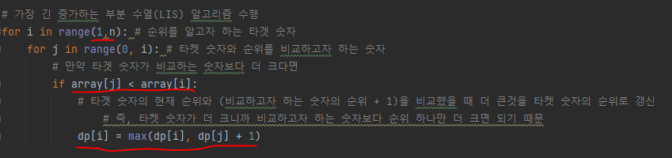
    
    - 코드를 그림으로 구현하면
      
        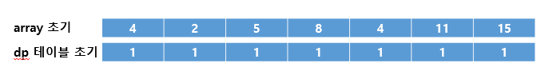
        
        - 타겟넘버 2
      
        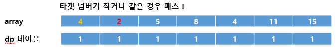

        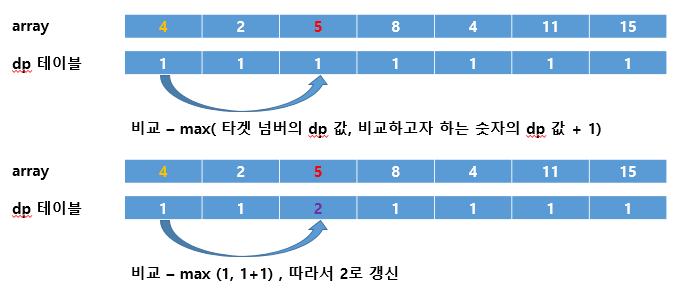

        - 타겟넘버 5
      
        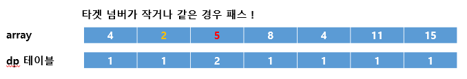

        - 타겟넘버 8
      
        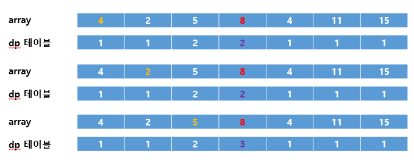
        
        - 타켓넘버 4
      
        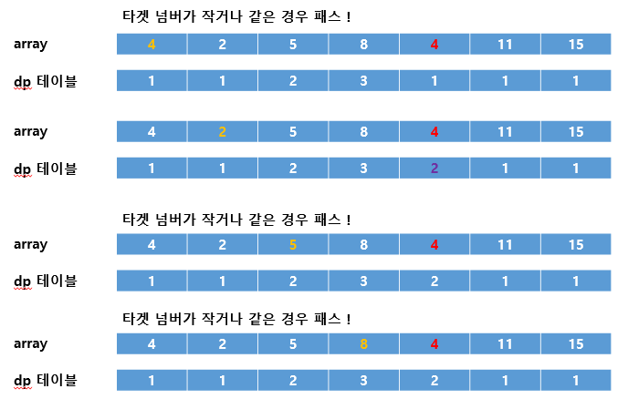

        - 타겟넘버 11
      
        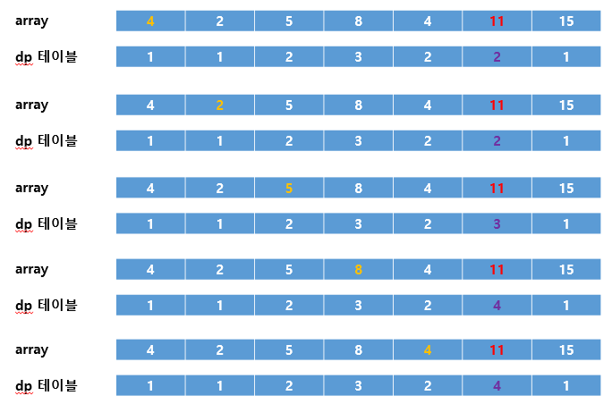

        - 타겟넘버 15
    
        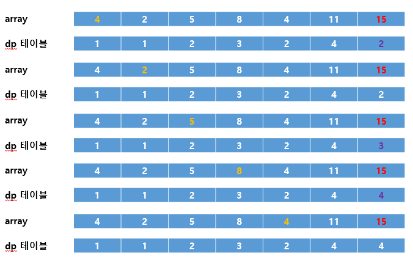

        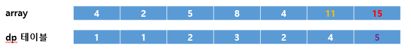

        - 완료
        
        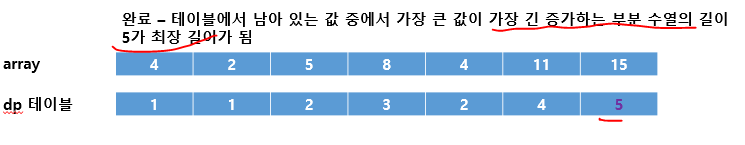