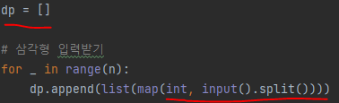
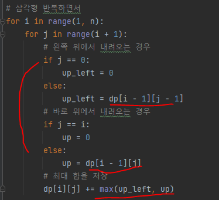
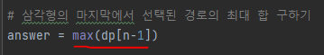

# 문제 유형 
- 다이나믹 프로그래밍 
  - 삼각형의 맨 위층부터 아래에 있는 수중 하나를 선택하며 아래 층으로 내려올 때 선택된 수의 합이 최대인 것을 찾는 문제
    - 각 칸마다 선택되어 수들의 최대 합을 저장하기 위해 다이나믹 프로그래밍 사용
  - Bottom-Up 방식으로 구현
    - 반복문과 DP 테이블 사용

# 주요 코드 개념
- DP 테이블
  
  

- 점화식 구현 
  - 삼각형에서 올 수 있는 방향이 왼쪽 위와 바로 위 2가지 방향이 있음 
  - dp[i][j] = dp[i][j] + max(왼쪽 위 칸의 최대 합, 바로 위칸의 최대 합)
    
    

# 주의 코드 개념
- 마지막 행또는 마지막 열에서 최대값 찾을 때 for문 돌리지말고 행또는 열에 대한 리스트 뽑아서 max에 바로 넣기

  

# 시간복잡도 