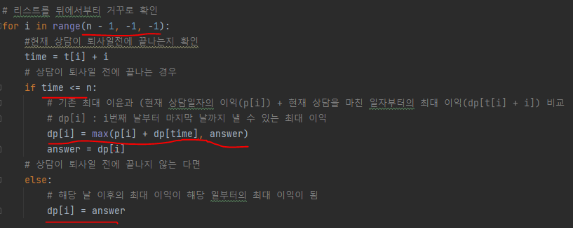

# 문제 유형
- 다이나믹 프로그래밍
  - 퇴사전까지 상담을 진행해서 얻을 수 있는 최대 이익을 구하는 문제
  - 이를 위해 현재 상담일자까지의 이윤이 중복되어 계산되기 때문에 다이내믹 프로그래밍 사용

# 주요 코드 개념
- DP 테이블 사용
  
  

- 점화식 구현 
  - 예를 들어, 1일차에 상담을 진행한다면 1일차 상담은 3일에 걸쳐서 상담을 진행함 
    - 1일차에 상담 진행하는 경우, 최대 이익은 (1일 차의 상담 이익 + 4일부터의 최대 상담 이익)이 됨
    - 따라서, 현재 날짜의 최대 이익을 알기 위해서는 현재 날짜의 상담을 진행한 후의 날짜부터의 최대 상담 이익을 알아야 되므로 뒤쪽 날짜부터 거꾸로 계산하며 문제를 해결해야함 
    - 점화식으로 표현하면,
      - dp[i] = max(p[i] + dp[t[i] + i]], max_value)
        - dp[i] : i번째 날부터 마지막 날까지 낼 수 있는 최대 이익
        - p[i] : 현재 상담일자의 이익
        - dp[t[i] + i]] : 현재 상담에서 상담이 필요한 일수만큼 지난 일자부터의 최대 이익 
  
    

# 시간복잡도