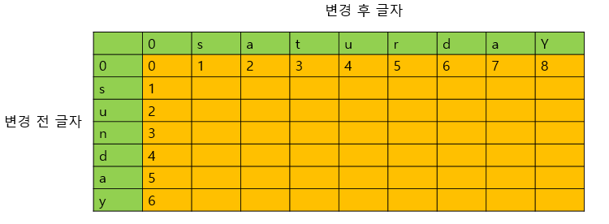
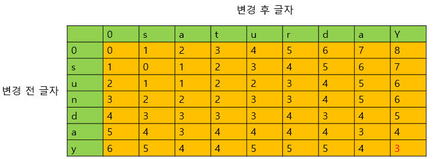

# 문제 유형
- 다이나믹 프로그래밍
  - 최소 편집 거리(문자열 A를 문자열 B로 만들기 위해 사용한 연산의 수) 를 구하는 문제
    - 문자열 A를 문자열 B로 만드는데 사용해야하는 연산의 수를 2차원 DP 테이블에 저장하기 때문 
# 주요 코드 개념
- DP 테이블 
  - 각 문자열의 최소 편집 거리를 담을 2차원 테이블
    - 각 칸은 해당 글자에서 다른 글자로 변경하기 위해 필요한 최소 편집 거리를 의미

      

      
      - 주황색 : dp 테이블 영역
    
    - 모든 편집 거리 계산한 후 dp 테이블 
    
      

      - dp[n][m]이 변경 전 글자에서 변경 후 글자까지의 최소 편집 거리가 됨 

- 점화식
  - 행과 열에 해당하는 문자가 서로 같다면, 왼쪽 위에 해당하는 수를 그대로 대입
    - dp[i][j] = dp[i -1][j -1]
    
  - 행과 열에 해당하는 문자가 서로 다르다면, 왼쪽(삽입), 위쪽(삭제), 왼쪽 위(교체)에 해당하는 수 중에서 가장 작은 수에 1을 더해 대입
    - dp[i][j] = 1 + min(dp[i][j - 1], dp[i - 1][j], dp[i - 1][j - 1])

    
  

# 시간복잡도