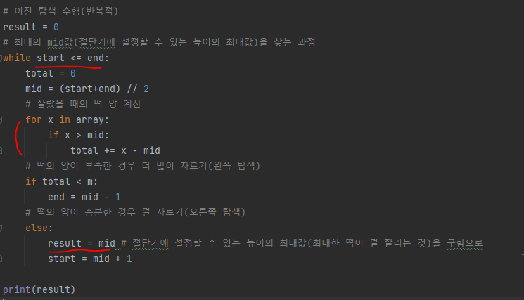

# 문제 유형
- 이진탐색
- 파라메트릭 서치 유형 문제
  - 최적화 문제를 결정 문제로 바꾸어 해결하는
  - 원하는 조건을 만족하는 가장 알맞은 값을 찾는 문제에 주로 파라메트릭 서치 사용
  - 범위 내에서 조건을 만족하는 가장 큰 값을 찾으라는 최적화 문제라면 이진 탐색으로 결정 문제를 해결하면서 범위를 좁혀갈 수 있음
# 주요 코드 개념
  - 적절한 절단기 높이를 찾을 때까지 절단기 높이 H를 반복해 조정  
    - 만족하는 조건에 맞게 탐색 범위를 좁혀가는 과정을 이진 탐색을 통해 구현
  
# 시간복잡도
