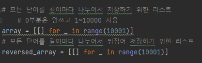
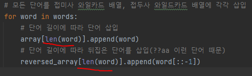
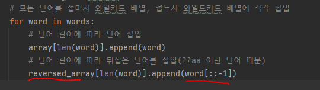
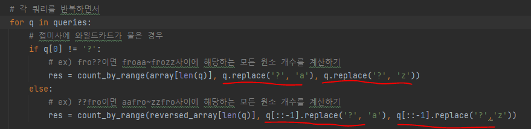
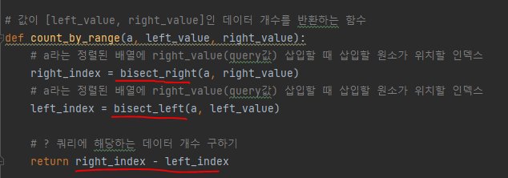

# 문제 유형
- 이진 탐색
  - 각 쿼리 키워드에 매치되는 모든 단어의 개수를 세는 문제
    - 쿼리 키워드 개수(2~100,000) 이고 단어 개수(2~ 100,000)이므로 매치하는지 확인해야할 데이터의 개수가 매우 많기 때문에 완전탐색이 아니라 이진탐색을 사용해야함
  
# 주요 코드 개념
- 기본적으로 쿼리의 길이와 단어 길이가 같은 경우에 매치되는 후보가 될 수 있으므로 주어진 단어들을 각 길이에 맞춰 분류해야함 
  
  

  

- ??fro와 같이 와일드카드가 앞에 나오는 경우를 처리하기 위해 기존 단어를 뒤집은 배열을 사용
  - orf??로 바꾸어서 동일한 함수 적용하기 위함
  
  

- fro??의 ?를 a와 z로 치환하여 그 사이에 해당하는 모든 원소 개수를 계산하면 fro?? 쿼리에 매치하는 단어 개수 계산가능

  

  - 이진 탐색 라이브러리 bisect_right, bisect_left 함수 사용
    - 데이터 개수를 구하기 위해서는 froaa를 삽입했을 때 위치하는 인덱스 위치와 frozz를 삽입했을 때 위치하는 인덱스를 찾아서 두 인덱스의 차이를 계산
    
    

# 시간복잡도