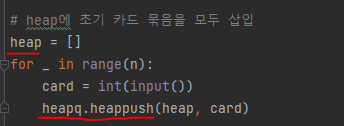
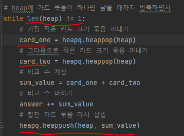

# 문제 유형
- 정렬 
  -가장 작은 크기의 두 카드 묶음을 합치기 위해 카드 묶음을 넣을 때 자동으로 정렬되는 heapq 사용
- 그리디 알고리즘
  - 매 상황에서 무조건 가장 작은 크기의 두 카드 묶음을 합치면 되기 때문
  - 최적해 아이디어
    - 항상 가장 작은 크기의 두 카드 묶음을 합쳤을 때 최적의 해 보장 
  
# 주요 코드 개념
- 카드 묶음 크기를 넣을 때 카드 묶음 크기 순서대로 정렬하기 위해 우선순위 큐 heapq 사용

  

- 가장 작은 카드 크기 묶음 2개 꺼내서 비교수 계산하고 합친 묶음 다시 삽입
  
  

# 주의 코드 개념
- 한번 정렬한 이후에도 계속 원소를 넣을 때마다 정렬이 되어야 하는 경우, 우선순위 큐(heapq) 사용하기

# 시간복잡도