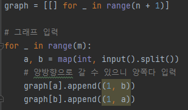
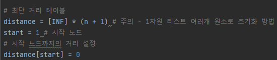
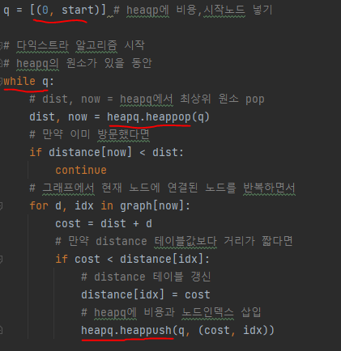
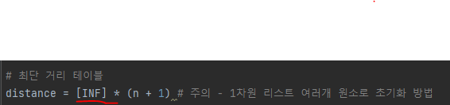

# 문제 유형 
- 최단거리 
  - 다익스트라 알고리즘
    - 1번 노드(헛간)로부터 가장 최단 거리가 긴 노드를 찾는 문제이기 때문에 한 노드로부터 다른 모드 노드로의 최단 거리를 계산하는 알고리즘인 다익스트라 알고리즘 사용
  - BFS
    - 문제에서의 거리가 1이기 때문에 BFS로도 해결 가능
# 주요 코드 개념
- 그래프 생성

  

- 최단 거리 테이블 생성

  

- 다익스트라 알고리즘 구현 
  - heapq로 구현
  
  

# 주의 코드 개념 
- 1차원 리스트 여러개 원소로 초기화 방법

  

# 시간복잡도