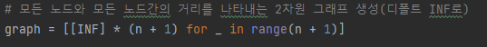
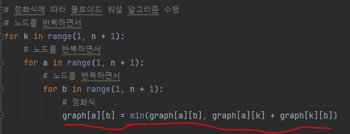
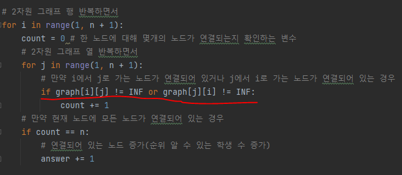

# 문제 유형
- 최단거리 
  - 플로이드 워셜 알고리즘
    - 어떤 노드가 어떤 노드에 대해서 도달할 수 있다면 성적을 비교할 수 있다는 말이므로,
      따라서, 한 노드가 이외의 다른 노드들에 도달할 수 있다면 그 노드의 순위를 알 수 있다는 의미
      이를, 모든 노드에 대해서 확인해야 하기 때문에 모든 노드에 대해 모든 노드까지의 거리를 계산하는 플로이드 워셜 알고리즘 사용

# 주요 코드 개념
- 거리를 저장하는 2차원 그래프
  
  

- 점화식 
  
  

- 순위를 알 수 있는 조건에 따라 순위를 알 수 있는 학생 수 계산
  - 순위를 알 수 있는 경우
    - A에서 B로 도달이 가능하거나, B에서 A로 도달이 가능하면 '성적 비교'가 가능한 것

  

# 시간복잡도 