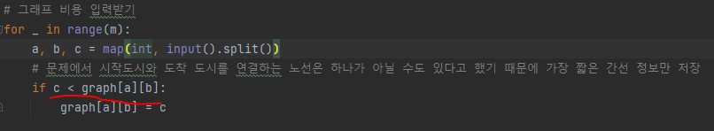
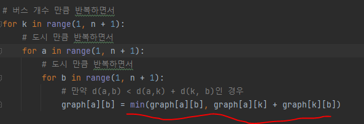

# 문제 유형
- 최단거리
  - 플로이드 위셜
    - 전체도시에서 전체도시로 가는 최소 비용을 계산하는 문제이기 때문

# 주요 코드 개념
- 그래프 생성
  - 문제에서 시작도시와 도착 도시를 연결하는 노선은 하나가 아닐 수도 있다고 했기 때문에 가장 짧은 간선 정보만 저장
  
    

- 점화식 
  - a로부터 b로 가는 거리 = min(a로부터 b로 가는 거리, a로부터 k로 가는 거리 + k로부터 b로 가는 거리)

  

# 시간복잡도