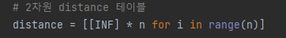
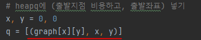
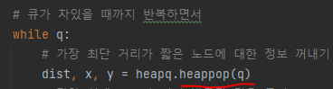
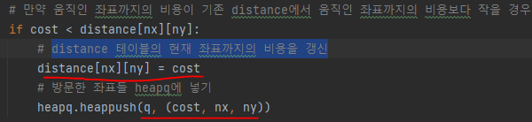

# 문제 유형 
- 최단거리
  - 다익스트라 알고리즘 
    - 한 지점에서 한 지점으로 가는 최단 거리 구하는 문제이기 때문

# 주요 코드 개념
- distance 테이블 생성 
  - 출발 좌표부터 각 좌표까지의 최소거리를 저장하기 위해 사용
  - 여기서는 2차원 맵에 대한 정보를 저장하기 위해 2차원 테이블로 구현

  

- heapq 사용 
  - 최단거리인 노드부터 먼저 처리하기 위해 사용

  

  

- 움직인 좌표까지의 비용이 기존 distance에서 움직인 좌표까지의 비용보다 작을 경우 distance 테이블의 현재 좌표까지의 비용을 갱신
  - 그리고, 방문한 좌표(노드)들 heapq에 넣기

  

# 시간복잡도 