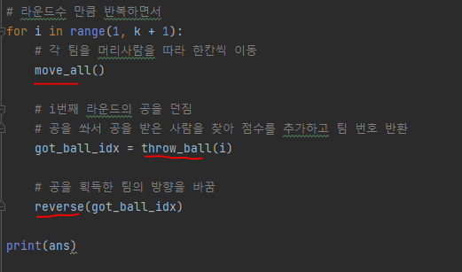
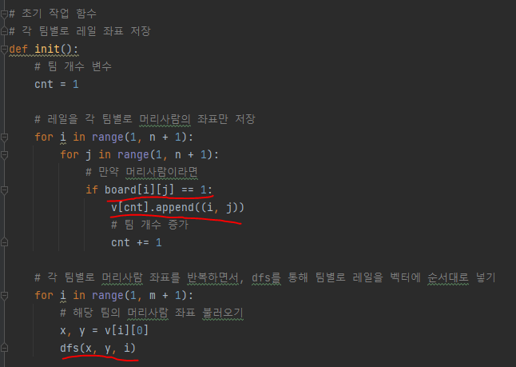
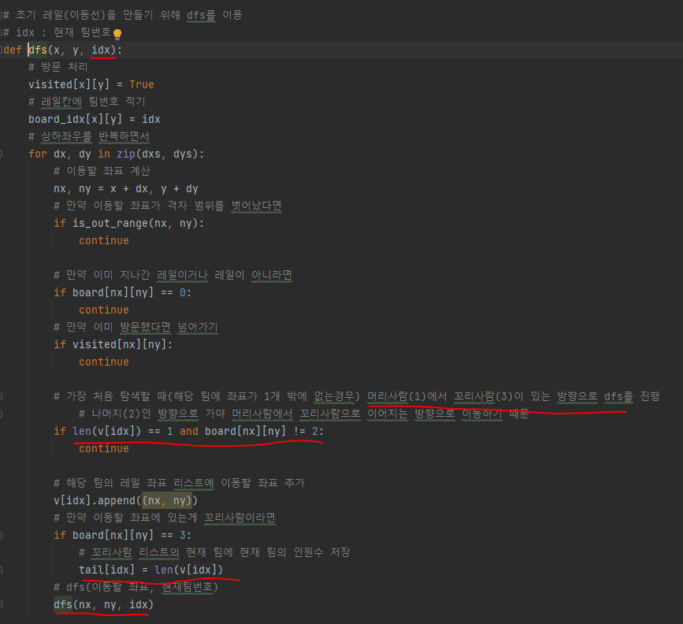
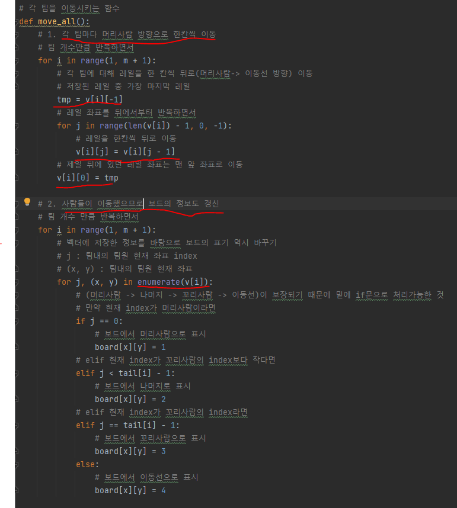
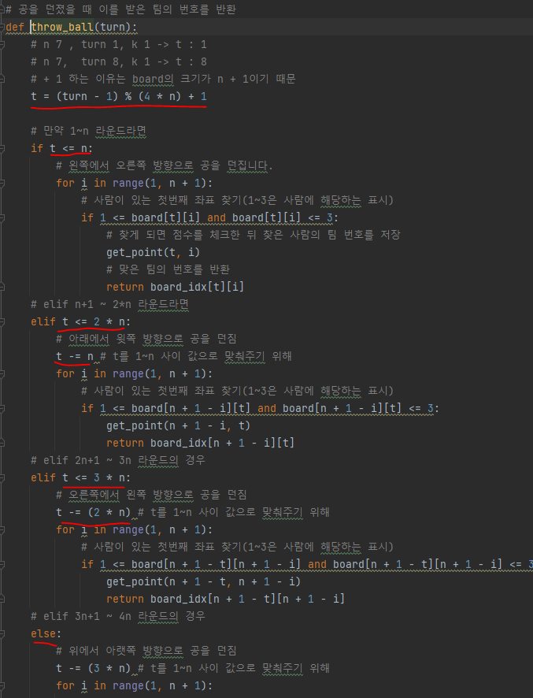
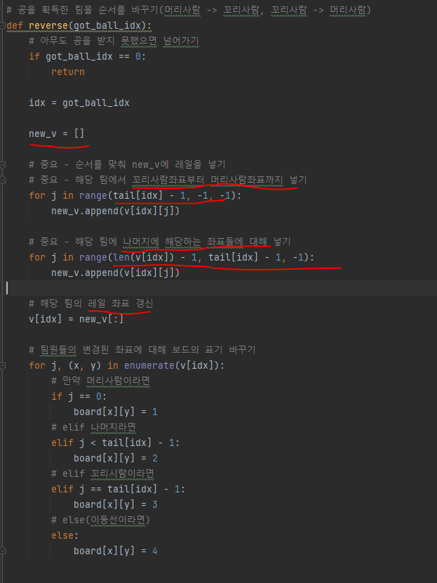

# 문제 유형
- 시뮬레이션 + DFS
    - 팀별로 레일을 벡터에 순서대로 넣을 때 DFS 사용

# 주요 코드 개념
- 전체 simulate 함수
  
  

- 이동전 구현을 위한 기본적인 처리하는 함수
  - 레일을 각 팀별로 머리사람의 좌표만 저장하고, 각 팀별로 머리사람 좌표 반복하면서 , dfs를 사용해 레일을 순서대로 저장 
    - 각 팀별로 레일 좌표를 저장하는 변수는 (머리사람 -> 나머지 -> 꼬리사람 -> 이동선)이 보장
  
    

    

    - 이동예시
    
      

- 각 팀마다 머리사람 방향으로 한칸씩 이동하는 함수

  

- 공을 쏴서 공을 받을 사람을 찾아 점수를 추가하는 함수

  

- 공을 획득한 팀의 방향을 바꾸는 함수

  

  - 예시
    
   