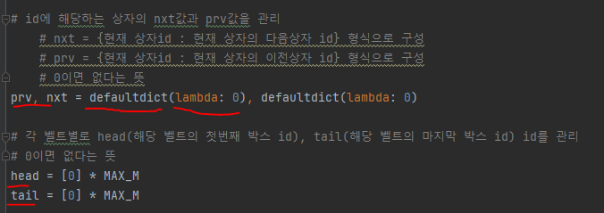
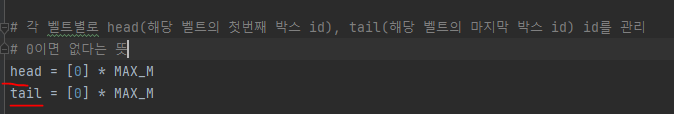
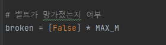
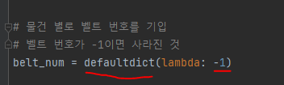
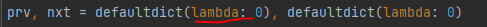
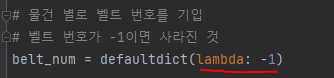

# 문제 유형
- 시뮬레이션
  - q번에 걸쳐 명령을 순서대로 진행했을 때 원하는 결과를 출력하는 문제
    - 리스트 자료구조의 함수를 직접 구현하고 거기서 특정한 로직을 더 처리하는 문제같음

# 중요 코드 개념
- id에 해당하는 상자의 nxt값과 prv값을 dictionary로 관리

    

- 각 벨트의 맨 앞 상자 id와 맨 뒤 상자 id를 따로 관리

    

- 벨트 망가짐 여부 따로 관리

    

- 상자별 벨트 번호 관리 변수

    
 
# 주의 코드 개념
- defaultdictionary 사용법

    

    
  

# 시간복잡도
- 리스트안에 벨트를 queue로 구현했지만 시간초과 났음
- dictionary 방식으로 구현해야 시간초과 안남