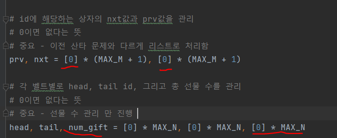
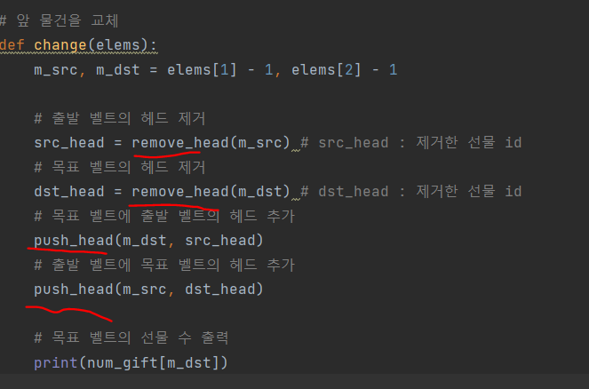
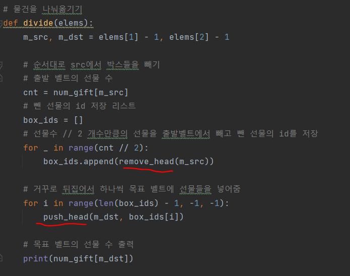
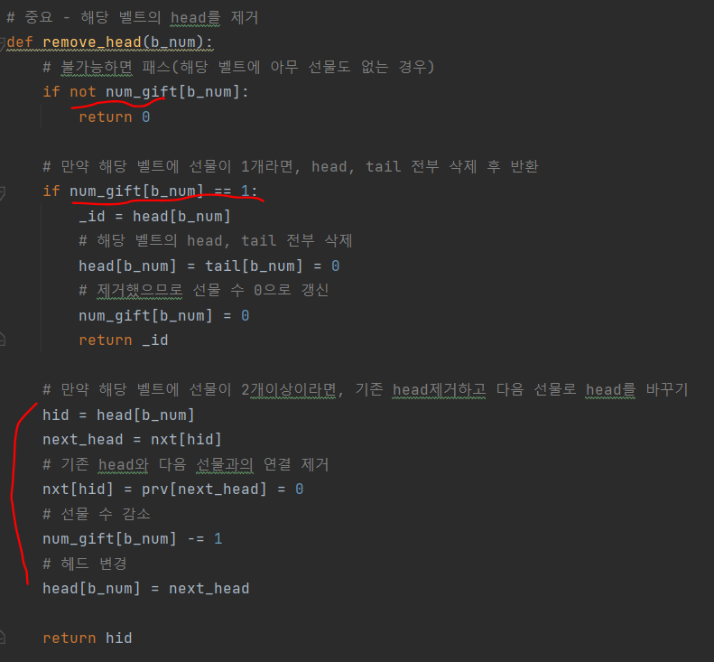
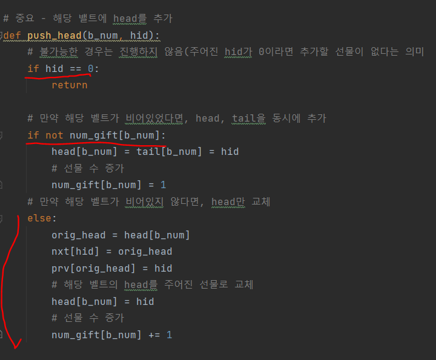
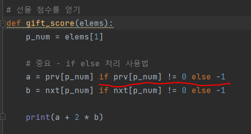

# 문제 유형
- 시뮬레이션
  - Doubly-LinkedList

# 주요 코드 개념
- prv, nxt 리스트로 처리
- num_gift 선물 수 관리 변수 사용해서 선물 수 계산하는 데 사용

    

- 앞 물건 교체하는 명령과 물건을 나눠옮기는 명령에 대해 벨트의 헤드를 추가 또는 제거하는 함수를 따로 만들어서 구현

    

    

  - 경우의 수를 벨트의 선물 수를 다음과 같이 나눠서 코드 구현 
    - 0개인 경우
    - 1개인 경우
    - 2개 이상인 경우

    - 제거함수 
      
      
    
    - 추가함수

      

- if else 사용법으로 코드 단축

    