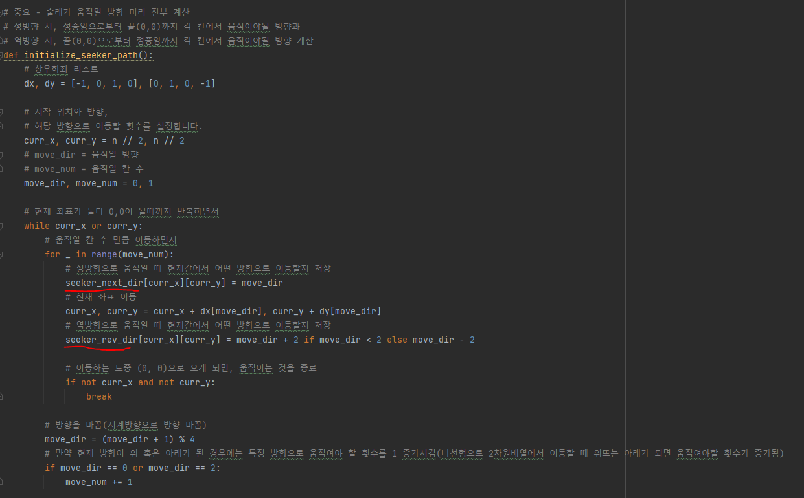
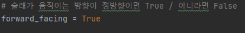
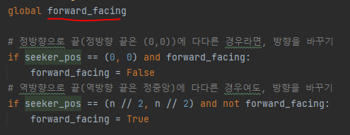
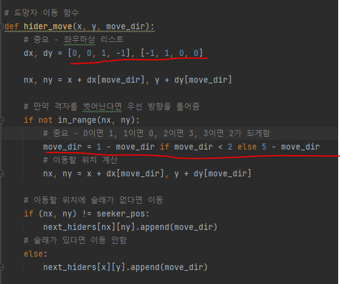

# 문제 유형
- 구현 - 시뮬레이션

# 중요 코드 개념
- 술래가 움직일 방향 미리 전부 계산 
  - 정방향시 움직일 방향과, 역방향시 움직일 방향을 따로 저장(나선형으로 이동하는 방식 대신 이렇게 구현했음)
  
    

- 움직일 방향이 현재 정방향인지 역방향인지 확인하는 변수 사용

    

    

- 도망자 이동 함수에서는 방향 리스트 순서를 좌,우,하,상으로 해서 방향 틀어주는 처리 보다 쉽게함

    

- global 변수 활용해도 됨 

# 주의 코드 개념
