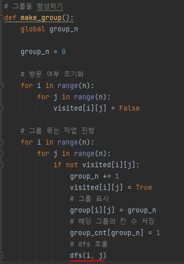
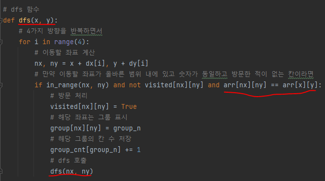
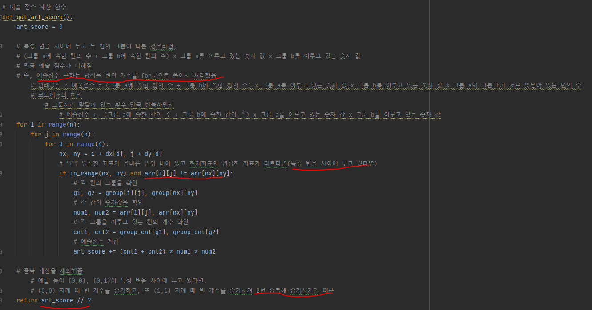
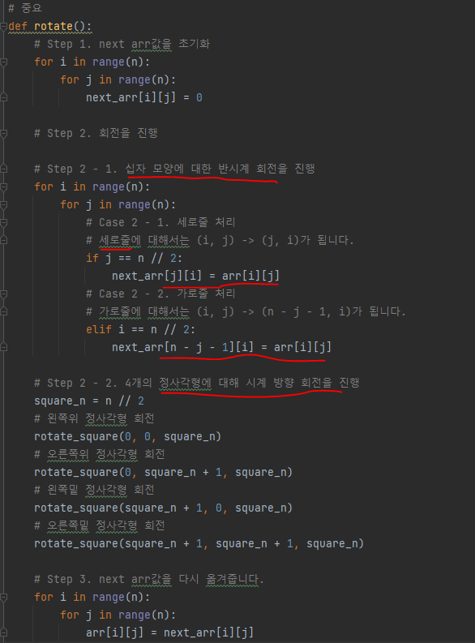
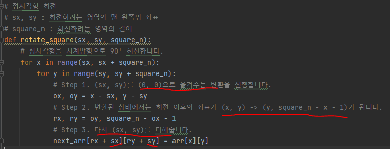

# 문제 유형 
- 시뮬레이션 + DFS
  - 주어진 순서대로 (초기 + 1회전 + 2회전 + 3회전 예술 점수의 합)을 구하는 문제
  - 그룹 형성할 때 DFS 사용

# 중요 코드 개념
- 그림의 예술 점수 구하기
  - 그룹 형성
    - DFS를 통해 처리
        
        
  
              
        
    - 예술 점수 계산 
        
        
    
- 그림 회전
  - 십자 모양 반시계 방향 회전
    
    

  - 정사각형 시계 방향 회전

    

  - 회전 이해안될 경우 notion 회전 알고리즘 참고

# 주의 코드 개념

# 시간복잡도 
- O(N^2)
