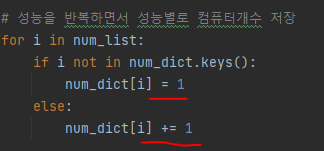
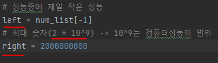
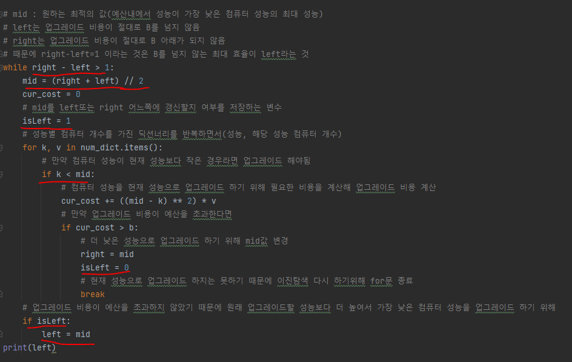

# 문제 유형
- 이진 탐색
  - B원 이하의 총 비용으로 업그레이드 수행해, 성능이 가장 낮은 컴퓨터의 성능을 최대화할 때 최선의 최저성능 구하기
    - 즉, B의 예산을 이용해 A이상으로 만들 수 있는 가장 큰 자연수 A의 값(가장 낮은 컴퓨터 성능)을 탐색을 활용해 찾아내는 문제
  - 2 x 10^9 ~ 성능이 가장 낮은 컴퓨터의 성능이 1이 될때까지 가능한 모든 성능에 대해서 반복해야하므로, 완전탐색으로는 탐색해야할 개수가 너무 많음
    - 따라서, 이진탐색 문제를 사용해 해결

# 주요 코드 개념
- Dictionary에 성능별로 컴퓨터 개수 저장

  

- 이진 탐색

  

  

  