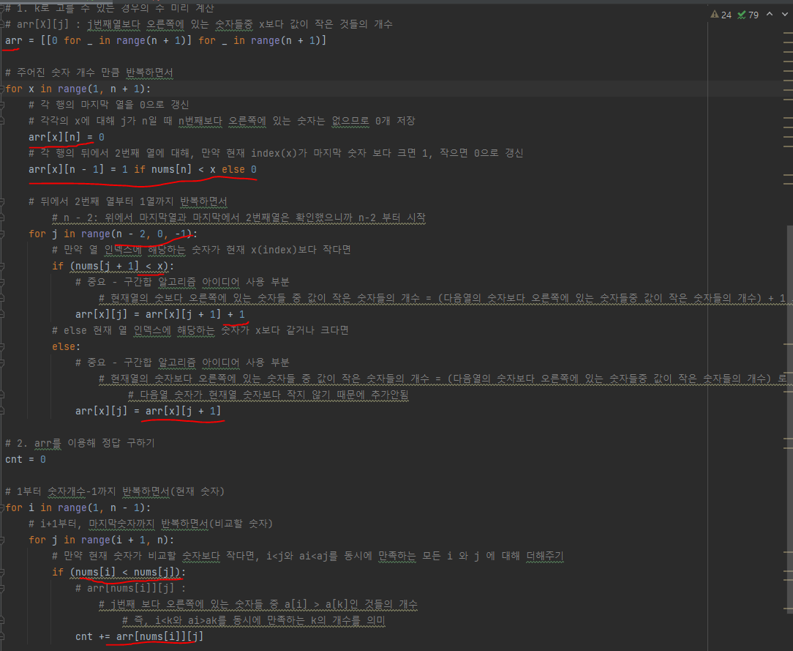

# 문제유형
- 구간합 알고리즘
  - 일반적인 완전탐색 방법으로 순서쌍 (i,j,k)을 모두 탐색하면서 조건을 만족하는 순서쌍을 찾을 경우 O(N^3)이므로 시간 초과됨
  - 따라서, 구간합 알고리즘을 사용해서 시간단축해야 문제 해결가능

# 중요 코드 개념
- arr[x][j] : 
  - j번째열 보다 오른쪽에 있는 숫자들중 x보다 값이 작은 것들의 개수들을 저장하는 2차원 배열
  
    